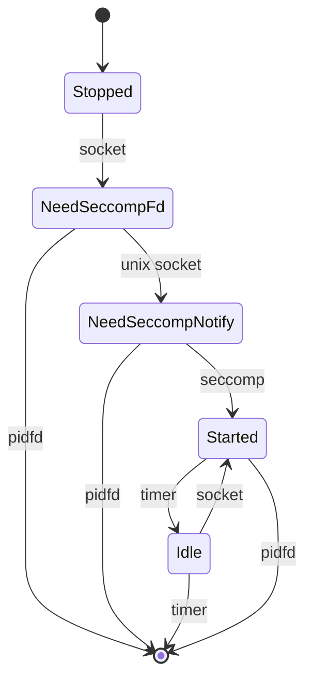

## State


## Config
```
# comment lines start with #
8000 /usr/bin/some_command some_args
# continued commands start with whitespace
     --some_more_args

# empty lines also continue commands
     --some_even_more_args
```
